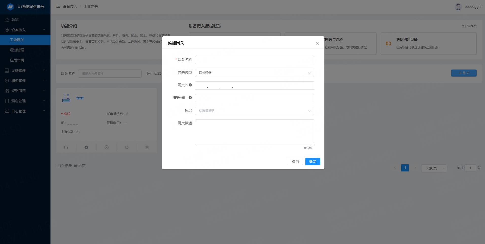

# 设备接入

## 1、创建网关 

::: tip 简介
网关是指能够直接连接物联网平台的设备
:::

操作步骤

    1. 进入平台【设备接入】-【网关管理】界面，点击右上角的【+网关】进行创建

    2. 填写网关配置项

    网关配置项填写说明

| 字段&#12288;&#12288;&#12288;&#12288;&#12288;  | 字数限制&#12288;&#12288;&#12288; | 是否必填&#12288;&#12288;&#12288; |     特殊限制      | 
| :--------------- | :----------- |  :----------- |  :----------- | 
| 网关名称           | 32字         |  必填         |   不可重名 | 
| 网关描述           |   256        |  -            |   - | 
| 网关ip            |   -          |   -            |   填写网关ip和管理端口，用于网关连接配置，当两者完整填写时，可打开网关连接配置页面，若填写错误，将会导致无法正确打开配置页面； | 
| 管理端口           |   -          | -              |  当网关在线时，不可修改网关ip和管理端口；                | 
| 网关删除           |   -           | -             |  当网关在线时，或网关关联设备时，不可删除网关； | 

    3. 激活并启用网关

    完成网关创建后，可进入【网关详情页】，点击【网关连接配置】，进入到配置界面。

